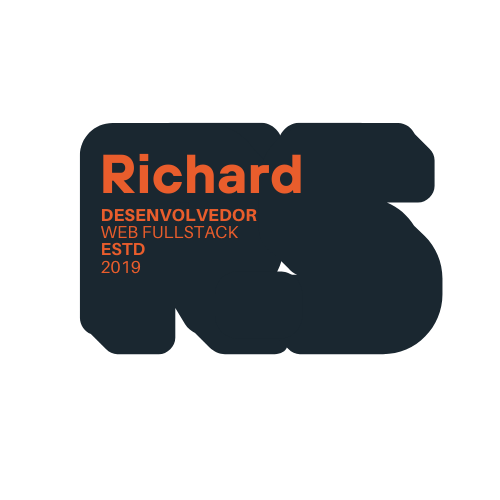

<h1 align="center">
  Richard Salviano | Portfólio Pessoal
</h1>

<p align="center">
  

  
  
  <a href="https://github.com/RickFerreira/rickferreira.github.io/commits/master">
    
  </a>

  <a href="https://github.com/RickFerreira">
    
  </a>
</p>

<p align="center">
  <a href="#-sobre-o-projeto">Sobre</a>&nbsp;&nbsp;&nbsp;|&nbsp;&nbsp;&nbsp;
  <a href="#-tecnologias">Tecnologias</a>&nbsp;&nbsp;&nbsp;|&nbsp;&nbsp;&nbsp;
  <a href="#-features-e-personalizações">Funcionalidades</a>&nbsp;&nbsp;&nbsp;|&nbsp;&nbsp;&nbsp;
  <a href="#-como-executar">Como Executar</a>&nbsp;&nbsp;&nbsp;|&nbsp;&nbsp;&nbsp;
  <a href="#-layout">Layout</a>&nbsp;&nbsp;&nbsp;|&nbsp;&nbsp;&nbsp;
  <a href="#-créditos-e-licença">Créditos</a>
</p>

<br>

<p align="center">
  
</p>

## 💻 Sobre o projeto

Este é o meu **Portfólio Pessoal**, desenvolvido para apresentar minha trajetória, experiências e projetos como Desenvolvedor.

O objetivo deste projeto foi criar uma interface **elegante, responsiva e performática**, onde recrutadores e clientes possam ter acesso rápido ao meu currículo, minhas redes sociais e meu histórico profissional.

O site foi construído utilizando conceitos modernos de desenvolvimento Web, mantendo uma estrutura de código limpa e semântica.

---

## 🚀 Tecnologias

O projeto foi desenvolvido utilizando as seguintes tecnologias:

- [HTML5](https://developer.mozilla.org/pt-BR/docs/Web/HTML) - Estrutura Semântica
- [CSS3](https://developer.mozilla.org/pt-BR/docs/Web/CSS) - Estilização Avançada (Variáveis, Animações)
- [JavaScript](https://developer.mozilla.org/pt-BR/docs/Web/JavaScript) - Lógica e Interatividade
- [Git](https://git-scm.com/) - Versionamento de Código
- [GitHub Pages](https://pages.github.com/) - Hospedagem

---

## ✨ Features e Personalizações

Embora baseado em um template, o projeto sofreu **refatorações profundas** para atender à minha identidade visual e necessidades:

- **Responsividade:** Ajustes manuais de Media Queries para garantir leitura perfeita em celulares, tablets e desktops.
- **Seção de Projetos:** Cards dinâmicos para exibição de trabalhos realizados.
- **Animações:** Pequenas animações e interatividade que deixam o site visualmente mais bonito.
- **Timeline de Carreira:** Seção estilizada mostrando a evolução profissional e acadêmica.
- **Padrão de cores e fontes:** Escolha específica de fonte, cores e outras estilizações, que mostram um pouco da minha personalidade.
- **Animação de Digitação:** Desde a primeira versão desse portfólio, eu adicionei logo no início uma animação que fazia o texto mudar e resolvi manter.

---

## 🎨 Layout

O design foca na experiência do usuário (UX), utilizando contraste alto para facilitar a leitura e animações sutis ao rolar a página (Scroll Reveal).

### Cores Principais

| Cor              | Hex       | Uso                  |
| ---------------- | --------- | -------------------- |
| ⚫ Azul Profundo | `#050505` | Background Principal |
| 🟠 Laranja Vivo  | `#e25134` | Destaques e Botões   |
| ⚪ Branco        | `#FFFFFF` | Títulos e Textos     |
| 🔘 Cinza         | `#888888` | Textos secundários   |

---

## 🔧 Como executar

Como é um projeto estático (HTML/CSS/JS), é muito simples rodar em sua máquina.

### Pré-requisitos

Antes de começar, você vai precisar ter instalado em sua máquina as seguintes ferramentas:
[Git](https://git-scm.com), [VSCode](https://code.visualstudio.com/).

### 🎲 Rodando o projeto

```bash
# Clone este repositório
$ git clone [https://github.com/RickFerreira/rickferreira.github.io.git](https://github.com/RickFerreira/rickferreira.github.io.git)

# Acesse a pasta do projeto no terminal/cmd
$ cd rickferreira.github.io

# Abra a pasta no VS Code
$ code .

# Dica: Instale a extensão "Live Server" no VS Code
# Clique com botão direito no index.html e escolha "Open with Live Server"

```

O site abrirá no seu navegador padrão (geralmente em `http://127.0.0.1:5500/index.html`).

---

## 📜 Créditos e Licença

Este projeto foi **adaptado e personalizado** por Richard Salviano.

* **Design Base:** Template original criado pela [StyleShout](https://styleshout.com/).
* **Implementação & Modificações:** Código refatorado, traduzido e customizado por [Richard Salviano](https://github.com/RickFerreira).

Sinta-se à vontade para usar este código como estudo, mantendo os devidos créditos.

---

## 👨‍💻 Autor

<table>
<tr>
<td align="center">
<a href="https://github.com/RickFerreira">


<sub><b>Richard Salviano</b></sub>
</a>
</td>
</tr>
</table>

<div align="center">
<a href="#top">☝🏽 Voltar ao topo</a>
</div>
<br />

```

```
